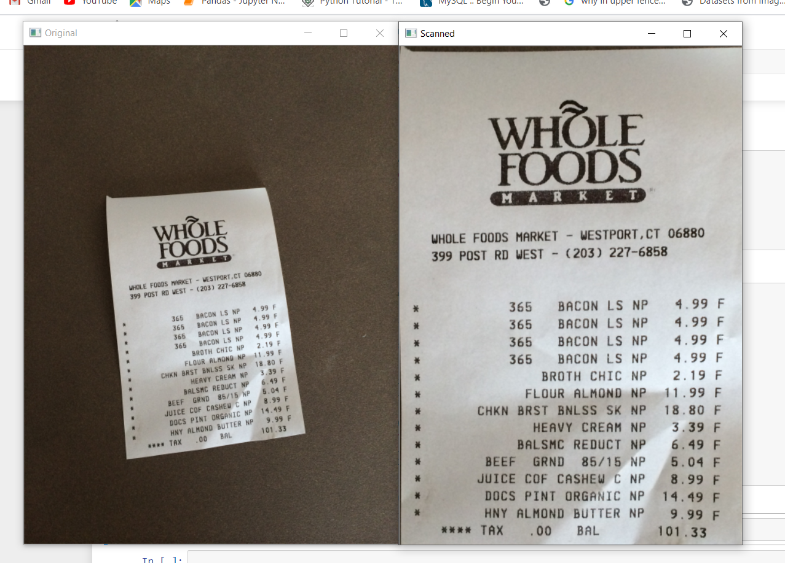
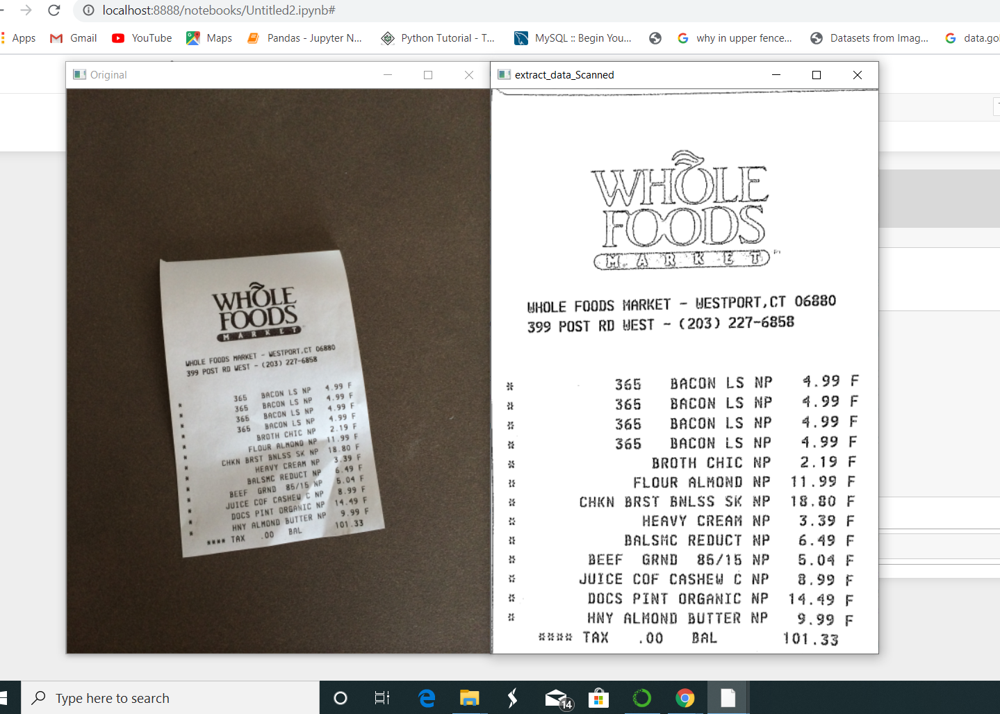

# Project-using-opencv
- <h3>live sketch using opencv (filename --->  webcam_live_image.ipynb)</h3>
  - different filters applied to images 
- <h3>document scanner project (filename ---> document_scanner.ipynb)</h3>
  - scanned picture using this program file(first output style)
    

    
    

  -  Also, scanned picture using this program file (second output style)
     

     
     

